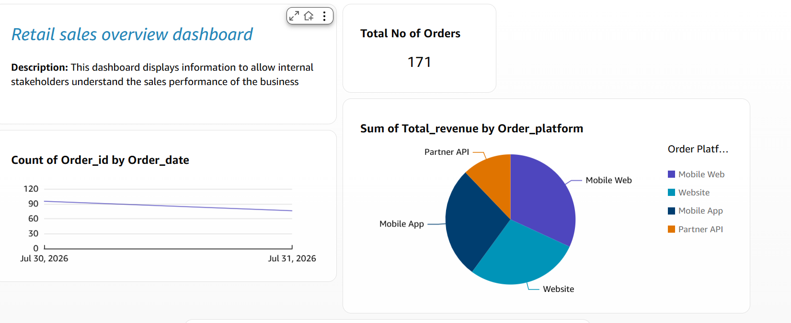
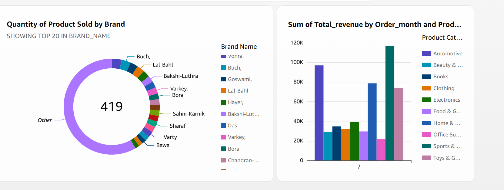
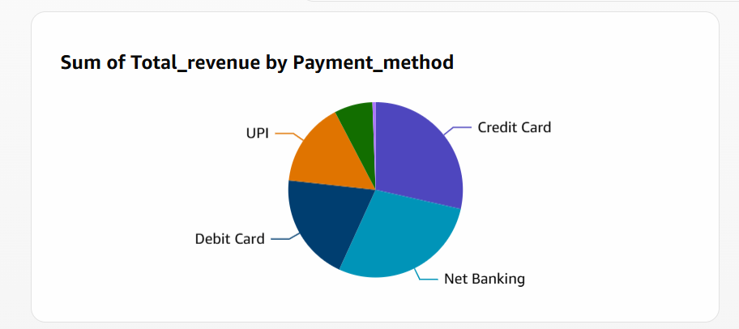
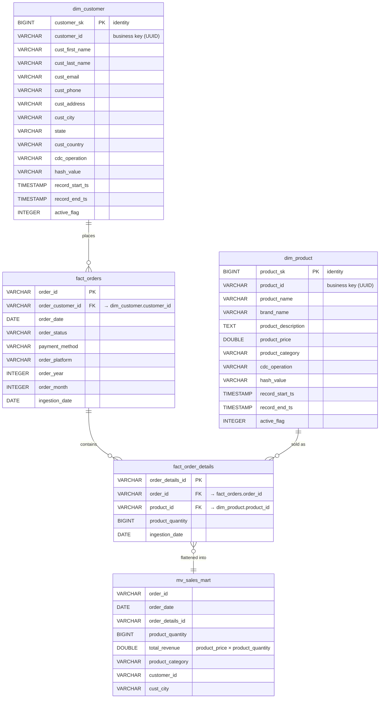

# Retail E-Commerce Data Pipeline

A batch data platform that takes daily e-commerce operational data — customers, products, orders, and order line items — and turns it into a dimensional warehouse and a query-ready analytics mart that Amazon QuickSight can sit on top of.

The pipeline runs on Apache Airflow 3.1.3 (Docker Compose, CeleryExecutor). Each scheduled run lands raw CSV into an S3 Bronze layer, spins up a transient Amazon EMR cluster, runs four PySpark jobs in parallel to produce a cleaned and partitioned Parquet Silver layer, loads that Silver output into PostgreSQL over JDBC, and then calls PL/pgSQL stored procedures that merge staged rows into SCD Type 2 dimensions. The EMR cluster is terminated as soon as the Spark work finishes.

Raw operational data is hard to report on directly. Order rows carry foreign keys, not names. Product descriptions are free text containing commas and line breaks that break naive CSV parsing. Customer attributes change over time, and an OLTP table only ever shows the current value — so "what city was this customer in when they placed that order?" becomes unanswerable. Column names arrive in the source system's casing convention, dates arrive as strings, and a full name arrives as one field when analysts want to filter on last name. Running dashboard queries against the operational store also puts analytical scan load on a system designed for transactional writes.

This project addresses those problems with layer separation and explicit versioning. Bronze keeps the source payload untouched so any downstream mistake can be replayed. Spark does the renaming, typing, derivation, and hashing, writing columnar Parquet partitioned by date. PostgreSQL holds the dimensional model, where `sp_merge_dim_customer()` and `sp_merge_dim_product()` close the previous version of a changed record and insert a new one with an open end date. The final output is `sales.mv_sales_mart` — a materialized view that pre-joins orders, line items, products, and customers and computes line-level revenue, so a BI tool queries one flat object instead of a four-table join.

---

## Business Problem

The data lives in four related datasets that only become useful when combined:

| Dataset | What it holds | Why it can't be used alone |
|---|---|---|
| `customers` | UUID, name, email, phone, address, city, state, country, signup date | Attributes change; the source only shows the latest value |
| `products` | UUID, name, brand, description, price, category | Price changes over time, so historical revenue can't be recomputed from the current price |
| `orders` | Order UUID, customer UUID, timestamp, status, payment method, platform | Contains keys, not descriptive attributes; no revenue figure |
| `order_details` | Line item UUID, order UUID, product UUID, quantity | Quantity without price is not revenue |

Concrete problems this repository solves:

**Multiple batches arrive for the same entity.** The daily generator can emit several rows for one `customer_id` across a batch. Loading those directly would create duplicate dimension rows. The merge procedures deduplicate with `ROW_NUMBER() OVER (PARTITION BY customer_id ORDER BY record_start_ts DESC)` and keep only the newest version per key before touching the dimension.

**History is lost on update.** If a customer relocates or a product is repriced, overwriting the row silently rewrites past reporting. Both dimensions are SCD Type 2: the prior version is closed with `record_end_ts` and `active_flag = 0`, and the new version is inserted with `record_end_ts = 9999-12-31` and `active_flag = 1`.

**Source formats are inconsistent and fragile.** Product descriptions are multi-line free text with embedded commas and quotes. Every Spark reader explicitly sets `multiLine`, `quote`, and `escape` so rows don't shear mid-record. Column names arrive camelCase (`orderId`, `productCategory`) and are standardised to snake_case at Silver. `orderDate` arrives as a string and is cast with `to_date`.

**Analytical queries shouldn't hit raw storage.** Bronze CSV is unusable for aggregation at scale. Silver is Parquet, partitioned by `ingestion_date` (or `order_year` for orders), so the Gold job reads one day's slice instead of scanning the full history.

**Business users need one object, not four.** `mv_sales_mart` materialises the joins and the `product_price * product_quantity` revenue calculation once, rather than every dashboard re-deriving it.

**A structural change to one entity shouldn't stall everything.** The four Silver jobs are independent EMR steps submitted in parallel; only the Gold load waits on all four.

---

## Solution Overview

```
Synthetic source generators (Faker + pandas)
  → S3 Bronze layer            (CSV, partitioned by date=YYYY-MM-DD)
  → Amazon EMR + PySpark       (4 parallel transformation jobs)
  → S3 Silver layer            (Parquet, partitioned)
  → PySpark Gold job           (JDBC write into PostgreSQL)
  → PostgreSQL staging tables  (stage_dim_customer, stage_dim_product)
  → SCD Type 2 merge procs     (sp_merge_dim_customer, sp_merge_dim_product)
  → Dimensions + facts         (dim_customer, dim_product, fact_orders, fact_order_details)
  → sales.mv_sales_mart        (materialized view)
  → Amazon QuickSight
```

Stage responsibilities:

| Stage | Responsibility |
|---|---|
| **Generators** (`include/generators/`) | Produce customer, product, order, and order-detail records with realistic weekday/weekend, month-end, holiday, and sale-event distributions. Every record carries an `op` flag (`I`/`U`) that drives change handling downstream. |
| **`S3BronzeUploader`** (`include/utils/s3_helper.py`) | Serialises DataFrames to CSV in memory and writes them to `Bronze/{table}/date={date}/{file}.csv` via boto3. Also reads back Bronze prefixes so daily orders reference existing customers and products. |
| **Airflow** (`dags/main_pipeline.py`) | Schedules the run, uploads the PySpark files to S3, creates and terminates the EMR cluster, submits and waits on each Spark step, then calls the merge procedures. |
| **EMR + Spark** (`include/silver_scripts/`) | Rename, type-cast, derive, hash, and repartition each entity; write Parquet to Silver. |
| **Gold job** (`include/gold_scripts/gold_script.py`) | Read the current Silver partitions and write them over JDBC into PostgreSQL staging and fact tables. |
| **PostgreSQL** (`SQL/`) | Hold the dimensional model, apply SCD Type 2 on merge, and expose the analytics mart. |
| **QuickSight** | Read `sales.mv_sales_mart` for dashboarding. |

---

## Architecture


### Why the pipeline is split into layers

Bronze exists so the pipeline never has to go back to the source. If a Silver transformation has a bug, the raw payload for that date is still in S3 and the job can be re-run against it. Silver exists so that every downstream consumer reads one agreed-upon shape — snake_case columns, real dates, split names, a change hash — rather than each consumer re-implementing cleanup. Gold exists because dimensional modelling, referential joins, and SCD merges are relational problems that a database handles better than a file layer.

The layers also give the pipeline distinct failure boundaries. A malformed CSV fails in Silver, not after the warehouse has already been half-written.

### Why Spark

The transformations themselves are simple, but they're applied across every record in a partition, and the historical initial load covers a full year of orders in one pass. Spark on EMR lets that run distributed and lets each entity be a separate step submitted in parallel to one cluster. The cluster is transient and spot-priced (`"Market": "SPOT"`, `m4.xlarge`, one master and one core node), created at the start of the run and torn down at the end, so nothing is paid for outside the batch window. `EmrTerminateJobFlowOperator` carries `trigger_rule="all_done"`, so the cluster is terminated even when a Spark step fails — the failure mode that would otherwise leave an idle cluster running.

### Why orchestration is required

The run has hard ordering constraints that a cron script would handle badly: data must exist in Bronze before scripts are uploaded, scripts must exist in S3 before EMR steps reference them, the cluster must reach `WAITING` before steps can be added, all four Silver steps must succeed before the Gold step runs, and the merge procedures must run only after the Gold load has committed. Airflow expresses this as a DAG, sensors (`EmrJobFlowSensor`, `EmrStepSensor`) poll for real cluster and step state instead of sleeping, and `{{ ds }}` is threaded into `spark-submit` so every job knows exactly which date it is processing.

### Why the warehouse model helps

Facts hold what happened and dimensions hold what things were. Splitting them means `fact_orders` stays narrow and append-friendly while `dim_customer` can carry multiple historical versions of the same customer. Analysts get one revenue grain (`order_details_id`) and descriptive attributes attached by join rather than duplicated into every transaction row.

---

## Key Engineering Features

| Feature | Implementation | Why It Matters |
|---|---|---|
| Bronze / Silver / Gold separation | `Bronze/` CSV and `Silver/` Parquet prefixes in S3; `gold_script.py` loads PostgreSQL | Raw data stays replayable; each layer has one job |
| Transient EMR cluster per run | `EmrCreateJobFlowOperator` with `JOB_FLOW_OVERRIDES` (EMR 6.4.0, Spark, SPOT `m4.xlarge` ×2), terminated by `EmrTerminateJobFlowOperator` | No cluster cost between batches; spot pricing for batch-tolerant work |
| Guaranteed cluster teardown | `trigger_rule="all_done"` on the terminate task | A failed Spark step can't leave a cluster running |
| Real state polling, not sleeps | `EmrJobFlowSensor(target_states={"WAITING"}, poke_interval=5, timeout=3600)`, `EmrStepSensor` per step | Steps are submitted only when the cluster can accept them; failures surface immediately |
| Parallel entity transformation | Four `EmrAddStepsOperator` tasks fan out from `Is_EMR_Created`, converge before Gold | Independent entities don't queue behind each other |
| Runtime code shipping | `PythonOperator` + `S3Hook.load_file` uploads each PySpark file to `s3://bucket/Scripts/` before submission | Spark jobs always run the version currently in the DAG folder |
| Date-parameterised jobs | `--process-date {{ ds }}` and `--bucket` passed to `spark-submit`, parsed by `get_arg()` in each script | The same script processes any date; enables targeted re-runs |
| Partitioned Silver storage | `partitionBy("ingestion_date")` for customers, products, order details; `partitionBy("order_year")` for orders | Gold reads a single partition instead of the full dataset |
| Columnar Silver format | Parquet with schema retained from Spark | Column pruning and compression for downstream reads |
| Change-detection hash | `sha2(concat_ws('', …), 256)` over business columns, stored as `hash_value` on both dimensions | Compact fingerprint per version, kept alongside every SCD row |
| SCD Type 2 dimensions | `sp_merge_dim_customer()` and `sp_merge_dim_product()` close the old row and insert the new one | Historical attribute values are preserved, not overwritten |
| Staging-then-merge load | Spark appends to `stage_dim_customer` / `stage_dim_product`; procedures merge and then `TRUNCATE` the staging table | The dimension is only ever touched by one controlled statement; staging is left clean for the next run |
| Deduplication at merge | `ROW_NUMBER() OVER (PARTITION BY key ORDER BY record_start_ts DESC)`, keeping `row_num = 1` | Multiple same-key rows in one batch produce exactly one dimension version |
| Empty-batch guards | `if df.count() > 0:` in every Silver script; `try/except` around the optional product path in Gold | A day with no new products doesn't fail the DAG |
| Free-text-safe CSV parsing | `multiLine`, `quote='"'`, `escape='"'` on every Spark CSV reader | Product descriptions with commas and newlines don't corrupt rows |
| Fact indexing | Indexes on `fact_orders(order_date)`, `fact_order_details(order_id)`, `fact_order_details(product_id)` | Supports the mart's join and date-filter access patterns |
| Analytics mart | `sales.mv_sales_mart` materialized view with pre-computed `total_revenue` | BI reads one flat object instead of a four-table join |
| Separate initial-load path | `ecommerce_initial_load` DAG with `schedule=None` | Historical seeding is a deliberate manual action, not something `catchup` can trigger |
| Credentials outside source control | `S3_BUCKET`, `AWS_ACCESS_KEY`, `AWS_SECRET_KEY`, `EC2_IP`, `DATABASE`, `DB_USERNAME`, `DB_PASSWORD` read from env; `.env` in `.gitignore` | No secrets in the repository |

---

## Data Pipeline Workflow

### 1. Data Ingestion

**Input** — Configuration in `include/config/data_config.py`: 10,000 customers, 500 products across 10 categories, weighted payment methods and order platforms, ten dated sale events, and five customer lifecycle segments.

**Processing** — Three generators inherit from `BaseGenerator`, which seeds `random`, `numpy`, and `Faker` (Indian locale) from the run date and provides UUID, phone, email, address, and audit-column helpers. Every generated frame receives `op`, `created_at`, `updated_at`, `batch_id`, and `source` columns.

- `CustomerGenerator` — `generate_initial_customers()` spreads signups over the past year using an exponential distribution so recent months are denser. `generate_daily_new_customers()` applies a growth term, a weekend multiplier, a 10% chance of a campaign multiplier, and ±20% noise, capped at `max_daily`.
- `ProductGenerator` — prices drawn from a log-normal distribution around a per-category typical value, clamped to the category range, then rounded to psychological price points (₹999, ₹1499).
- `OrderGenerator` — daily volume is a base rate scaled by weekend (1.5×), month-end (1.3×), holiday months (1.8×), and sale-event multipliers. Order timestamps are drawn from an hourly weight curve peaking at lunch and evening. Order status is assigned by order age: same-day orders skew Pending/Confirmed, week-old orders skew Delivered. Line items per order are weighted 1–5 and products are sampled with inverse-price weighting.

**Output** — `S3BronzeUploader.upload_csv()` writes each DataFrame through an in-memory `BytesIO` buffer to `s3://{bucket}/Bronze/{table}/date={partition_date}/{filename}.csv`. Empty frames are skipped with a warning rather than writing an empty object.

**Purpose** — A stand-in for a source system extract that produces the same shapes and change patterns a real one would.

Two ingestion modes exist:

- **Initial load** (`ecommerce_initial_load`, `schedule=None`) — seeds the customer base and product catalogue into the `2026-01-01` Bronze partition, then runs only the customer and product Silver jobs before the Gold load and merges.
- **Daily incremental** (`ecommerce_daily_pipeline`, `0 2 * * *`, `catchup=False`) — `run_daily_pipeline()` reads back the full `Bronze/customers` and `Bronze/products` prefixes so orders reference entities that already exist, generates new customers daily and new products on every seventh business day, and writes only that day's slice.

### 2. Bronze Layer

**Input** — Serialised generator output.

**Processing** — None. Data is written exactly as produced, including source-casing column names (`customerId`, `orderDate`, `productCategory`) and audit columns.

**Output** — Date-partitioned CSV under `Bronze/{table}/date=YYYY-MM-DD/`.

**Purpose** — An immutable landing zone. Because the partition key matches the Airflow execution date, a Silver job can be re-run for any past date without re-contacting the source. Bronze also serves as the lookup surface for daily order generation.

### 3. Spark Transformation

Four PySpark jobs run as EMR steps. Each parses `--bucket` and `--process-date` with `get_arg()`, reads its Bronze partition with `inferSchema`, `header`, `multiLine`, `quote`, and `escape` set, and exits cleanly if the partition is empty.

**`customer_transformation.py`**
- Renames `customerId → customer_id`, `op → cdc_operation`, `name → cust_name`, `phone → cust_phone`, `address → cust_address`, `country → cust_country`, `city → cust_city`, `email → cust_email`
- Computes `hash_value = sha2(concat_ws('', cust_phone, cust_address, cust_country, cust_city, cust_name), 256)`
- Adds `record_start_ts = current_timestamp()`, `record_end_ts = lit('9999-12-31').cast(TimestampType())`, `active_flag = 1`, `ingestion_date = current_date()`
- Splits the full name into `cust_first_name` and `cust_last_name` using `element_at(split(cust_name, " "), 1|2)` and drops `cust_name`
- Projects an explicit 15-column contract, dropping `zipcode`, `signup_date`, and generator audit fields
- Writes Parquet partitioned by `ingestion_date`

**`product_transformation.py`**
- Renames `productId`, `productName`, `brandName`, `productDescription`, `productCategory`, `price`, `op` to snake_case
- Hashes name, brand, description, category, and price into `hash_value`
- Adds the same SCD fields and rounds `product_price` to two decimals
- Writes Parquet partitioned by `ingestion_date`

**`order_tranformation.py`**
- Casts `orderDate` with `to_date(col("orderDate").cast(DateType()))`
- Renames to `order_id`, `order_customer_id`, `order_date`, `order_status`, `payment_method`, `order_platform`; drops `op`
- Derives `order_year` and `order_month` from `order_date` for partitioning and time-series grouping
- Writes Parquet partitioned by `order_year`

**`orderdetails_transformation.py`**
- Renames to `order_details_id`, `order_id`, `product_id`, `product_quantity`; drops `op`
- Adds `ingestion_date`
- Writes Parquet partitioned by `ingestion_date`

Two clarifications on scope, so the boundaries are clear: deduplication is **not** performed in Spark — it happens at merge time in the stored procedures, keyed on the business key and ordered by `record_start_ts`. There is also no explicit null-imputation step; the projected column list acts as the schema contract, and type coercion is handled by the explicit casts above.

### 4. Silver Layer

| Dataset | Path | Partition key | Write mode |
|---|---|---|---|
| Customers | `Silver/customers/` | `ingestion_date` | overwrite |
| Products | `Silver/products/` | `ingestion_date` | overwrite |
| Orders | `Silver/orders/` | `order_year` | overwrite |
| Order details | `Silver/order_details/` | `ingestion_date` | overwrite |

Silver is Parquet with snake_case columns, real `DATE` and `TIMESTAMP` types, SCD control fields already populated, and a change hash per row. Because dimension records arrive pre-stamped with `record_start_ts`, `record_end_ts`, and `active_flag`, the warehouse merge does not need to compute them — it only decides which version wins.

Orders partition by `order_year` rather than ingestion date because the Gold job reads them with `.option("basePath", …)` against `order_year={year}`, which keeps year-scoped reads cheap.

### 5. Data Warehouse Loading

`gold_script.py` runs as the fifth EMR step, submitted with `--jars s3://{bucket}/jars/postgresql-42.7.3.jar` and given `--ec2-ip`, `--database`, `--db-username`, and `--db-password`. It builds `jdbc:postgresql://{ec2_ip}:5432/{database}` and writes:

| Source Silver partition | Target table | Mode |
|---|---|---|
| `Silver/customers/ingestion_date={ds}` | `sales.stage_dim_customer` | append |
| `Silver/products/ingestion_date={ds}` | `sales.stage_dim_product` | append (wrapped in `try/except`) |
| `Silver/orders/order_year={year}` | `sales.fact_orders` | append |
| `Silver/order_details/ingestion_date={ds}` | `sales.fact_order_details` | append |

Dimensions are never written directly by Spark. They go through staging tables that mirror the dimension schema, and only the stored procedures modify `dim_customer` and `dim_product`. That keeps version-closing logic in one place and inside a transaction.

Facts are loaded straight to their final tables since they are insert-only: `fact_orders` is keyed on `order_id`, `fact_order_details` on `order_details_id`. Relationships to the dimensions are logical — `fact_orders.order_customer_id → dim_customer.customer_id` and `fact_order_details.product_id → dim_product.product_id` — and enforced by indexes and the mart's join conditions rather than declared foreign-key constraints.

Airflow then runs `CALL sales.sp_merge_dim_customer();` followed by `CALL sales.sp_merge_dim_product();` through `SQLExecuteQueryOperator` on the `postgres_production` connection.

### 6. SCD Type 2 Processing

**The problem.** A customer moves from Pune to Mumbai. Overwrite the row and every historical order they placed now appears to have come from Mumbai — last quarter's regional revenue silently changes. SCD Type 2 keeps both versions and marks which one was in effect when.

**Entities.** `dim_customer` and `dim_product`, each with `record_start_ts`, `record_end_ts`, `active_flag`, and `hash_value`.

**How change is detected.** Silver stamps each row with `cdc_operation` (carried through from the generator's `op` flag) and a `hash_value` fingerprint of the business columns. The merge procedures branch on `cdc_operation`: `U`/`D` rows close the existing version, `I`/`U` rows are inserted as a new version. The hash is persisted on every row so that fingerprint-based comparison can be adopted without a schema change.

**How the old version is closed.**

```sql
UPDATE sales.dim_customer AS dc
SET record_end_ts = b.record_start_ts - interval '1 second',
    active_flag   = 0
FROM ( /* deduped stage: row_num = 1 per customer_id */ ) b
WHERE dc.customer_id  = b.customer_id
  AND dc.active_flag  = 1
  AND dc.record_end_ts > b.record_start_ts
  AND b.cdc_operation IN ('U','D');
```

The one-second offset means the closing timestamp of the old version and the opening timestamp of the new one never overlap, so an as-of query returns exactly one row. `active_flag = 1` guards against re-closing an already-closed version, and `record_end_ts > b.record_start_ts` prevents an out-of-order batch from closing a version that starts later.

**How the new version is inserted.** The same deduplicated set is inserted where `cdc_operation IN ('I','U')`, carrying the `record_start_ts`, `record_end_ts` (`9999-12-31`), and `active_flag = 1` that Spark already stamped. A new surrogate key is generated by the identity column, so the same `customer_id` can appear many times with distinct `customer_sk` values.

**Cleanup.** `TRUNCATE TABLE sales.stage_dim_customer;` runs at the end of the procedure, so staging always starts empty and a re-run can't re-merge yesterday's rows.

**Field meanings**

| Field | Meaning |
|---|---|
| `record_start_ts` | When this version became effective |
| `record_end_ts` | When it stopped being effective; `9999-12-31` marks the open, current version |
| `active_flag` | `1` for the current version, `0` for superseded versions — a cheap index-friendly filter |
| `hash_value` | SHA-256 fingerprint of the business columns for this version |
| `customer_sk` / `product_sk` | Surrogate key, unique per version; `customer_id` / `product_id` remain the stable business key |

**Example — customer `a3f1…9c` moves city**

Before the update batch:

| customer_sk | customer_id | cust_city | record_start_ts | record_end_ts | active_flag |
|---|---|---|---|---|---|
| 5012 | a3f1…9c | Pune | 2026-02-01 02:14:07 | 9999-12-31 00:00:00 | 1 |

An update arrives with `cdc_operation = 'U'` and `record_start_ts = 2026-03-14 02:11:52`:

| customer_sk | customer_id | cust_city | record_start_ts | record_end_ts | active_flag |
|---|---|---|---|---|---|
| 5012 | a3f1…9c | Pune | 2026-02-01 02:14:07 | 2026-03-14 02:11:51 | 0 |
| 7788 | a3f1…9c | Mumbai | 2026-03-14 02:11:52 | 9999-12-31 00:00:00 | 1 |

February orders can still be attributed to Pune; March onward resolves to Mumbai. Note that `record_start_ts` is Spark's `current_timestamp()` at Silver runtime, so version boundaries track processing time rather than a business-supplied effective date.

### 7. Analytics Layer

`SQL/DDL/sales_mart_sql.sql` creates one materialized view:

```sql
CREATE MATERIALIZED VIEW sales.mv_sales_mart AS
SELECT fo.order_id, fo.order_date, fo.payment_method, fo.order_platform,
       fo.order_month, fo.order_year,
       fod.order_details_id, fod.product_quantity,
       dp.product_name, dp.brand_name, dp.product_category,
       (dp.product_price * fod.product_quantity) AS total_revenue,
       dc.customer_id, dc.cust_city, dc.cust_country
FROM sales.fact_orders fo
JOIN sales.fact_order_details fod ON fo.order_id = fod.order_id
JOIN sales.dim_product   dp ON fod.product_id = dp.product_id
JOIN sales.dim_customer  dc ON fo.order_customer_id = dc.customer_id;
```

The grain is one row per order line item. It collapses a four-table join and the revenue arithmetic into a single stored object, so BI queries scan a flat table instead of re-joining facts to dimensions on every refresh.

Questions the mart's columns support directly:

- Revenue by day, month, and year — `total_revenue` with `order_date`, `order_month`, `order_year`
- Revenue and units by product category and brand — `product_category`, `brand_name`, `product_quantity`
- Revenue split by payment method and by order platform — `payment_method`, `order_platform`
- Geographic distribution — `cust_city`, `cust_country`
- Best-selling products by units or by value — `product_name` with `product_quantity` and `total_revenue`
- Order and line-item counts — distinct `order_id` and `order_details_id`

`order_status` is available on `fact_orders` for cancellation and return analysis, and is one join away from the mart.

### 8. Amazon QuickSight Dashboard





QuickSight connects to the PostgreSQL instance and reads `sales.mv_sales_mart` as its dataset. Because the mart is materialized and pre-joined at line-item grain, visuals aggregate one table rather than executing the four-table join per query, and SPICE ingestion has a single object to refresh.

The mart exposes the fields a sales dashboard is built from: `total_revenue` and `product_quantity` as measures, and `order_date`, `order_month`, `order_year`, `product_category`, `brand_name`, `product_name`, `payment_method`, `order_platform`, `cust_city`, and `cust_country` as dimensions. Refreshing the dashboard is a matter of running `REFRESH MATERIALIZED VIEW sales.mv_sales_mart;` after the DAG completes and re-ingesting into SPICE.

> Replace the image above with the exported dashboard screenshot at `docs/images/quicksight-dashboard.png`, and list the specific KPIs and charts it contains. The repository currently ships `docs/schema_diagram.png` only — the dashboard is configured in the QuickSight console and has no artefact in this repo.

---

## Data Model



| Table | Type | Grain | Key | Purpose |
|---|---|---|---|---|
| `sales.dim_customer` | Dimension (SCD Type 2) | One row per customer **version** | `customer_sk` PK, `customer_id` business key | Who the customer was at a point in time — name, contact, city, state, country. Multiple rows per `customer_id`; `active_flag = 1` selects the current version |
| `sales.dim_product` | Dimension (SCD Type 2) | One row per product **version** | `product_sk` PK, `product_id` business key | Catalogue attributes and price. Price history is preserved as versions, so past revenue is recomputable |
| `sales.stage_dim_customer` | Staging | One row per incoming customer record | `stage_customer_sk` | Landing table for the Spark JDBC write; deduplicated and merged, then truncated |
| `sales.stage_dim_product` | Staging | One row per incoming product record | identity column | Same role for products |
| `sales.fact_orders` | Fact (order header) | One row per order | `order_id` PK; `order_customer_id` → `dim_customer` | Order event: date, status, payment method, platform. Indexed on `order_date` and `order_customer_id` |
| `sales.fact_order_details` | Fact (line item) | One row per line item | `order_details_id` PK; `order_id` → `fact_orders`, `product_id` → `dim_product` | The measurable grain — quantity per product per order. Indexed on both foreign keys |
| `sales.mv_sales_mart` | Materialized view | One row per line item | — | Denormalised reporting object with `total_revenue` pre-computed |

`docs/schema_diagram.png` contains the schema diagram for the same model.

---

## Repository Structure

```text
Retail-E-Commerce-Data-Pipeline/
├── airflow/
│   ├── config/
│   │   └── airflow.cfg                        # Mounted to /opt/airflow/config/airflow.cfg
│   ├── dags/
│   │   ├── include/
│   │   │   ├── config/
│   │   │   │   └── data_config.py             # Volumes, categories, payment/platform weights, sale events
│   │   │   ├── generators/
│   │   │   │   ├── base_generator.py          # Seeding, UUID/phone/email/address helpers, audit columns
│   │   │   │   ├── customer_generator.py      # Initial + daily customers, SCD-2 update helper
│   │   │   │   ├── product_generator.py       # Catalogue, weekly new products, price-update helper
│   │   │   │   └── order_generator.py         # Orders + line items with seasonality and status logic
│   │   │   ├── silver_scripts/
│   │   │   │   ├── customer_transformation.py # PySpark → Silver/customers (Parquet)
│   │   │   │   ├── product_transformation.py  # PySpark → Silver/products
│   │   │   │   ├── order_tranformation.py     # PySpark → Silver/orders
│   │   │   │   └── orderdetails_transformation.py
│   │   │   ├── gold_scripts/
│   │   │   │   └── gold_script.py             # Silver → PostgreSQL over JDBC
│   │   │   └── utils/
│   │   │       ├── helper.py                  # run_initial_load / run_daily_pipeline
│   │   │       └── s3_helper.py               # S3BronzeUploader (upload_csv / read_csv)
│   │   ├── main_pipeline.py                   # DAG: ecommerce_daily_pipeline (0 2 * * *)
│   │   └── load_initial_data_dag.py           # DAG: ecommerce_initial_load (manual)
│   └── docker-compose.yaml                    # Airflow 3.1.3, CeleryExecutor, Redis, Postgres 16
├── SQL/
│   ├── DDL/
│   │   ├── schema_database.sql                # CREATE DATABASE production; CREATE SCHEMA sales
│   │   ├── customer_setup_sql.sql             # dim_customer + stage_dim_customer
│   │   ├── product_setup_sql.sql              # dim_product + stage_dim_product
│   │   ├── order_setup_sql.sql                # fact_orders + indexes
│   │   ├── order_details_setup_sql.sql        # fact_order_details + indexes
│   │   └── sales_mart_sql.sql                 # mv_sales_mart materialized view
│   └── SP/
│       ├── customer_dim_sp.sql                # sp_merge_dim_customer() — SCD Type 2
│       └── product_dim_sp.sql                 # sp_merge_dim_product()  — SCD Type 2
├── docs/
│   └── schema_diagram.png
├── .gitignore
└── README.md
```

### S3 layout produced at runtime

```text
s3://<S3_BUCKET>/
├── Bronze/{customers,products,orders,order_details}/date=YYYY-MM-DD/*.csv
├── Silver/customers/ingestion_date=YYYY-MM-DD/*.parquet
├── Silver/products/ingestion_date=YYYY-MM-DD/*.parquet
├── Silver/orders/order_year=YYYY/*.parquet
├── Silver/order_details/ingestion_date=YYYY-MM-DD/*.parquet
├── Scripts/{customer,product,order,orderdetails}_transformation.py
├── Scripts/gold/gold_script.py
├── jars/postgresql-42.7.3.jar                 # Required by the Gold step; not in the repo
└── emr-logs/
```

---

## Running the Project

### Prerequisites

- Docker and Docker Compose
- An AWS account with S3 and EMR access, plus the `EMR_EC2_DefaultRole` and `EMR_DefaultRole` service roles
- A PostgreSQL instance reachable from EMR (the DAGs expect it on an EC2 host, port 5432)

### 1. AWS setup

Create the S3 bucket and upload the PostgreSQL JDBC driver, which the Gold step loads with `--jars`:

```bash
aws s3 cp postgresql-42.7.3.jar s3://<your-bucket>/jars/postgresql-42.7.3.jar
```

The uploader defaults to region `ap-south-1`; change it in `s3_helper.py` if your bucket lives elsewhere.

### 2. Database setup

Run the SQL in order against your PostgreSQL instance:

```bash
psql -h <EC2_IP> -U <user> -f SQL/DDL/schema_database.sql
psql -h <EC2_IP> -U <user> -d production -f SQL/DDL/customer_setup_sql.sql
psql -h <EC2_IP> -U <user> -d production -f SQL/DDL/product_setup_sql.sql
psql -h <EC2_IP> -U <user> -d production -f SQL/DDL/order_setup_sql.sql
psql -h <EC2_IP> -U <user> -d production -f SQL/DDL/order_details_setup_sql.sql
psql -h <EC2_IP> -U <user> -d production -f SQL/SP/customer_dim_sp.sql
psql -h <EC2_IP> -U <user> -d production -f SQL/SP/product_dim_sp.sql
```

Create `sales.mv_sales_mart` from `SQL/DDL/sales_mart_sql.sql` after the first successful run, once the facts and dimensions hold data.

### 3. Environment file

Create `airflow/.env` (gitignored):

```bash
S3_BUCKET=<your-bucket>
AWS_ACCESS_KEY=<access-key>
AWS_SECRET_KEY=<secret-key>
EC2_IP=<postgres-host>
DATABASE=production
DB_USERNAME=<db-user>
DB_PASSWORD=<db-password>
AIRFLOW_UID=50000
_PIP_ADDITIONAL_REQUIREMENTS=faker apache-airflow-providers-amazon apache-airflow-providers-common-sql
```

The DAGs read all seven of the first variables at parse time with `os.environ[...]`, so a missing one causes an import error rather than a runtime failure.

### 4. Start Airflow

```bash
cd airflow
docker compose up airflow-init
docker compose up -d
```

The UI is at `http://localhost:8080`.

### 5. Airflow connections

Create both in **Admin → Connections**:

| Conn ID | Type | Used by |
|---|---|---|
| `aws_default` | Amazon Web Services | `S3Hook`, all EMR operators and sensors |
| `postgres_production` | Postgres | `SQLExecuteQueryOperator` calling the merge procedures |

### 6. Run

1. Trigger `ecommerce_initial_load` once to seed customers and products.
2. Unpause `ecommerce_daily_pipeline`; it runs at 02:00 daily with `catchup=False`.
3. Point QuickSight at `sales.mv_sales_mart`.

---

## Known Limitations

Stated plainly, since they shape how the pipeline behaves in practice:

- **Silver writes replace the dataset, not the partition.** Every Silver job uses `mode("overwrite")` against the dataset root with Spark's default static partition-overwrite behaviour, so a run clears prior partitions rather than adding to them. PostgreSQL is the system of record for history. Setting `spark.sql.sources.partitionOverwriteMode=dynamic` would scope the overwrite to the partitions being written.
- **Fact loads are append-only.** `gold_script.py` writes facts with `mode("append")`, so re-running a date inserts again rather than upserting. `fact_orders.order_id` and `fact_order_details.order_details_id` are primary keys, so an exact re-run of the same rows fails on conflict instead of duplicating — but a re-generation with fresh UUIDs would double-count. A staging-and-merge pattern like the one used for dimensions would make the fact load re-runnable.
- **Update events are not currently emitted daily.** `CustomerGenerator.generate_customer_updates()` and `ProductGenerator.generate_price_updates()` are implemented but not wired into `run_daily_pipeline` (the price-update block is commented out), so daily batches consist mostly of `I` records. The SCD Type 2 machinery downstream is complete and handles `U`/`D` correctly when those records arrive.
- **The mart does not filter for current dimension versions.** `mv_sales_mart` joins `dim_product` and `dim_customer` on business key without `active_flag = 1`, so once multiple versions of a key exist, each fact row matches every version and revenue fans out. Adding `AND dp.active_flag = 1 AND dc.active_flag = 1` — or an as-of join on `record_start_ts`/`record_end_ts` — resolves it.
- **`hash_value` is stored but not yet used for change detection.** The merge procedures branch on `cdc_operation`. Comparing the incoming hash against the current dimension row would let the pipeline skip no-op updates that carry a `U` flag but no actual attribute change.
- **`state` reaches staging but not the dimension.** `dim_customer` and `stage_dim_customer` both define `state`, but the `INSERT` in `sp_merge_dim_customer()` omits it from its column list.
- **Two DDL issues to fix before a clean run.** In `order_setup_sql.sql`, the customer index targets `sales_uk.fact_orders` instead of `sales.fact_orders`. In `product_setup_sql.sql`, the identity column of `stage_dim_product` is named `stage_customer_sk`.
- **No dependency manifest or tests.** There is no `requirements.txt`; Python packages are installed through `_PIP_ADDITIONAL_REQUIREMENTS`. There are no unit tests or a data-quality framework — the only checks in place are the `count() > 0` guards and `try/except` blocks in the Spark jobs.

## Tech Stack

| Layer | Technology |
|---|---|
| Orchestration | Apache Airflow 3.1.3 (CeleryExecutor, Redis broker, PostgreSQL 16 metadata DB) |
| Ingestion | Python, pandas, Faker, boto3 |
| Storage | Amazon S3 (CSV Bronze, Parquet Silver) |
| Processing | Apache Spark on Amazon EMR 6.4.0 (PySpark) |
| Warehouse | PostgreSQL on Amazon EC2, PL/pgSQL stored procedures |
| BI | Amazon QuickSight |
| Local runtime | Docker Compose |
