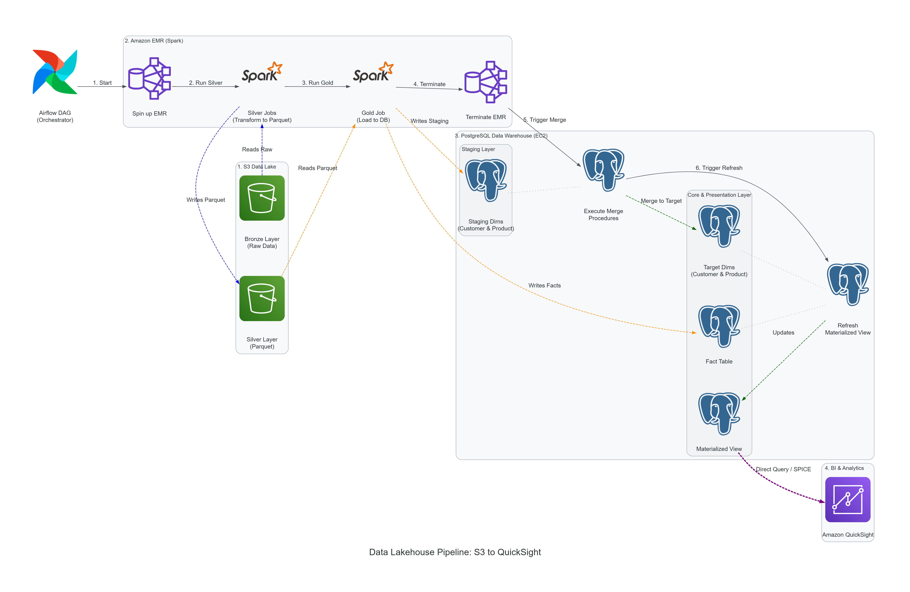

# Retail E-Commerce Data Pipeline
An idempotent, cost-optimized batch data platform that preserves historical customer/product states (SCD Type 2) and offloads analytical queries from the production OLTP database.

## 1. The Business Problem
The pain: Analytical GROUP BY queries run directly on the production PostgreSQL database, causing checkout timeouts during peak hours. Historical customer addresses are overwritten, making cohort analysis ("What did New Yorkers buy last year?") impossible. Manual daily CSV exports take 4 hours and frequently break.

The solution: A scheduled (daily) pipeline that extracts fragmented CSV data from S3, transforms it with Spark, and loads it into a dedicated analytics PostgreSQL instance with full SCD Type 2 history and a pre-joined materialized view (mv_sales_mart) for sub-second BI queries.

## 2. Architecture



## 3. Key Engineering Decisions & Trade-offs

| **Decision** | **The Choice** | **The Trade-off (Why not the obvious alternative?)** |
|---|---|---|
| **Processing Paradigm** | **Batch (Daily)** | Chosen over streaming (Kafka/Spark Streaming). Business requirement is daily reporting, not real-time. Accepts a 24-hour data lag in exchange for a 70% reduction in complexity and infrastructure cost. |
| **Compute Strategy** | **Ephemeral EMR** | Cluster spins up, runs 4 parallel Spark jobs, and terminates (`trigger_rule=all_done`). This saves ~90% on compute costs (~$25/month) compared to a persistent cluster (~$1,080/month). Accepts a 5-minute cold-start delay. |
| **Dimensional Modeling** | **SCD Type 2** | Full history is preserved (using `record_start_ts`, `record_end_ts`, `active_flag`). Marketing requires "time-travel" analytics. Adds 30% storage overhead but enables accurate historical cohort analysis. |
| **Change Detection** | **SHA-256 Hash + `IS DISTINCT FROM`** | A single hash comparison is exponentially faster in SQL than comparing 10+ columns with massive `OR` clauses. Fixed edge-case handling: `concat_ws` treats NULLs as empty strings, and `IS DISTINCT FROM` safely handles NULL hashes. |
| **Silver Layer Partitions** | **Dynamic Partition Overwrite** | Spark is configured with `spark.sql.sources.partitionOverwriteMode=dynamic`. This allows idempotent Silver writes—rerunning the same date replaces *only* that day's partition, never deleting historical years (unlike standard `overwrite` which wipes the root directory). |
| **Database Selection** | **PostgreSQL** | Total dataset is < 100 GB. Redshift/Snowflake would be overkill and 10x more expensive. PostgreSQL with proper indexing and a pre-joined materialized view handles the load perfectly. |
| **Idempotency (Gold Facts)** | **`DELETE` + `INSERT`** | Before inserting today's facts, the pipeline explicitly deletes existing records for that `ingestion_date`. Rerunning the pipeline 5 times produces 5 identical results—zero duplicates. |
| **Idempotency (Gold Dimensions)** | **`TRUNCATE` Staging** | Spark truncates staging tables (`stage_dim_customer`, `stage_dim_product`) at the *start* of every Gold run. This prevents duplicate key accumulation and cardinality violations if a previous run partially failed. |
| **Concurrent MV Refresh** | **`CONCURRENTLY`** | The materialized view is refreshed using `REFRESH MATERIALIZED VIEW CONCURRENTLY` (requires a unique index). This prevents `ACCESS EXCLUSIVE` locks, allowing QuickSight to read during the refresh window. |


## 4. Idempotency & Failure Recovery (Proven)

A Senior Engineer tests for reruns. Here is how this pipeline behaves:

- **Scenario: Silver fails halfway through.** → The EMR cluster terminates (cost saved). The Gold layer runs on the previous successful Silver data (since Gold reads specific date partitions). Rerun overwrites the incomplete Silver partition cleanly.
- **Scenario: `merge_customer` succeeds, but `merge_product` fails.** → The staging tables are `TRUNCATE`d at the start of the next Spark Gold run. The procedures use `ROW_NUMBER()` deduplication. Rerun applies the product changes without duplicating customers.
- **Scenario: Gold facts loaded, but QuickSight refresh fails.** → The facts were idempotently inserted. Rerunning the DAG runs `DELETE` + `INSERT` again, leaving the exact same data.
- **Scenario: Cron job misses data for a day.** → The `S3KeySensor` times out and fails the DAG. No empty data is pushed to production. An alert is triggered.

---

## 5. Results (Measurable)

| **MetricValue** | |
| ------------------------- | -------------------------------------------- |
| **Pipeline Runtime** | ~15 minutes (including 5-min EMR bootstrap) |
| **Cost per Run** | ~$2.50 (EMR SPOT instances + S3 + RDS) |
| **Dashboard Query Speed** | < 1 second (QuickSight on `mv_sales_mart`) |
| **Data Freshness** | Daily (6 AM reports available) |
| **Historical Coverage** | Full SCD Type 2 since pipeline inception |

---


## 6. Amazon QuickSight Dashboard


---

## 7. Production Caveats (What I would improve next)

- **Data Validation:** Currently, the pipeline only checks for empty files. Next iteration should integrate **Great Expectations** or **Deequ** to validate schema drift and null rates before loading Gold.
- **Infrastructure as Code:** The EMR and RDS infrastructure is manually defined. **Terraform** would make the entire stack reproducible.
- **Incremental Silver Loads:** While the Gold layer is incremental, the Silver layer currently overwrites the entire day's partition. For sub-hourly Bronze arrivals, we could switch to **append** on Silver and use `max(ingestion_date)` in Gold.
---
## 8. Quick Start
1. Configure **AWS** credentials and region, then create the Airflow connection:
   - `aws_conn_id`

2. Configure the **PostgreSQL** Airflow connection:
   - `postgres_production`

   Used in the DAG as:
   ```python
   conn_id="postgres_production"

3. Download the PostgreSQL JDBC driver:

    ```postgresql-42.7.3.jar```

4. For the first EMR setup, create the default IAM roles:
    ```
    JobFlowRole: EMR_EC2_DefaultRole
    ServiceRole: EMR_DefaultRole
    ```
5. Configure your S3 bucket and upload the required JDBC JAR.

6. Start the project:
    ```
    docker-compose up -d
    ```
7. Open Airflow, enable the DAG, and trigger the pipeline.
---
## Tech Stack
- **Orchestration:** Apache Airflow (CeleryExecutor)

- **Compute:** Amazon EMR (Spark 3.4, m4.xlarge SPOT instances)

- **Storage:** Amazon S3 (Bronze CSV, Silver Parquet)

- **Database:** PostgreSQL 15 (SCD Type 2, Materialized Views)

- **BI:** Amazon QuickSight


